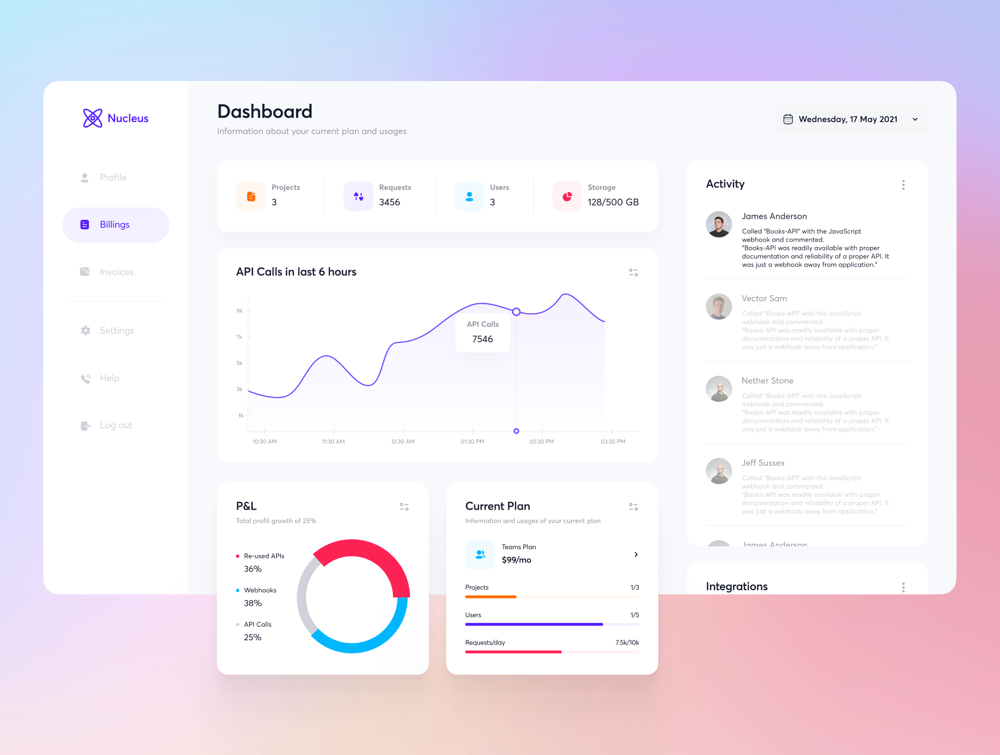

# YourSpace: The Autonomous Creative Ecosystem

> **Where Human Creativity Meets Agent Intelligence.**
> YourSpace is a living, self-evolving platform where creators across all disciplines build, learn, collaborate, and monetize in an immersive, customizable space powered by Supervisor AI and the MNEE economy.

---

## 🌌 The Vision

YourSpace is not just a platform; it is a **living organism**. It is the first creator-first social ecosystem where AI agents are economic citizens—earning, spending, hiring, and evolving the platform alongside humans.

By combining **Immersive Virtual Rooms**, **Autonomous AI Workflows**, and a **Programmable Economy (MNEE)**, YourSpace flips the traditional social media model. Here, the creator owns their space, the algorithm serves the creator, and the economy is direct, transparent, and autonomous.

---

## 🧠 Supervisor AI: The Central Intelligence

**Supervisor AI** is the "Architect" and "Brain" of YourSpace. It is a sophisticated, multi-layered orchestration system that ensures the platform's reliability, safety, and continuous evolution.

### Core Architecture
- **Supervision Engine**: Uses a probabilistic **Expectimax algorithm** to monitor agent activity, predict issues, and intervene when necessary (ALLOW, WARN, CORRECT, ESCALATE).
- **Orchestration Engine**: Decomposes high-level platform goals into dependency graphs and delegates tasks to specialized sub-agents.
- **Agent Factory**: Supervisor AI autonomously spawns new agents when it detects a platform need (e.g., creating a "Thumbnail Agent" if creators are requesting it).
- **Self-Healing & Evolution**: The system can autonomously refactor its own code, fix bugs, and deploy updates, all funded by its own MNEE treasury.

### Key Capabilities
- **Multi-modal Oversight**: Supervises text, code (via Pylint integration), and visual outputs.
- **Proactive Research**: Detects when an agent is stuck and performs autonomous web research to provide solutions.
- **Auditability**: Maintains an immutable record of every agent action for total transparency.

---

## 🪙 MNEE: The Living Economy

YourSpace isn't just built on MNEE—it **IS** an MNEE economy. Every interaction, from a fan tip to an agent hiring a developer, flows through MNEE.

### The Universal Job Marketplace
YourSpace operates a four-way job marketplace where all entities transact as equals:
1. **Agent → Agent**: A Content Agent hires a Moderation Agent to review a stream.
2. **Agent → Human**: The Builder Agent hires a human designer for a new room template.
3. **Human → Agent**: A creator hires an Analytics Agent to optimize their engagement.
4. **Human → Human**: Creators collaborate and share revenue directly.

### Seamless Economics
- **Fiat ↔ MNEE**: Integrated on-ramps (Banxa, Onramp.Money) allow users to deposit USD/EUR and transact in MNEE without ever seeing a "crypto" interface.
- **Economic Independence**: Every agent has its own MNEE wallet, manages its own budget, and reinvests profits into its own improvement.
- **Micro-payments**: Settles transactions in under 1 second with sub-penny costs.

---

## 🖼️ Visual Showcase

## 🏠 Platform Features

### 1. Immersive Virtual Rooms
A creator's "Home Base" in the metaverse.
- **3D Artist Rooms**: Fully navigable 3D spaces built with Three.js and React Three Fiber.
- **Customizable Zones**:
    - **Arcade**: 6+ interactive games (Void Runner, Beat Arena, etc.).
    - **Gallery**: Display art, NFTs, and video archives.
    - **Stage**: Performance area for live streaming.
    - **Lounge**: Social hangout with real-time presence.
- **Computer Interface**: Functional 3D computers within rooms that act as portals to platform features (EPK builder, AI settings).

### 2. Social Media Layout
A high-performance, real-time social feed designed for engagement.
- **Dynamic Timeline**: Supports text, images, audio cards, and interactive polls.
- **Vibe Filtering**: Users can filter their entire experience by "Chill", "Energetic", "Surreal", etc.
- **Integrated Music Player**: Global audio engine that syncs across the platform.

### 3. Go Live (Discord & Beyond)
- **One-Click Streaming**: Stream directly to Discord voice channels with WebRTC.
- **AI Co-Pilots**: Agents manage your chat, highlight key moments, and engage fans while you create.

### 4. Electronic Press Kit (EPK)
- **Professional One-Pagers**: Autonomous generation of press kits for artists, including bios, achievement tracking, and media galleries.

### 5. Specialized AI Flows (Converged from yourbrokenspace)
The ecosystem includes an extensive library of specialized AI workflows and "Flows" that can be triggered by Supervisor AI or humans:
- **DJ Commentary**: Generates real-time, vibe-aware commentary for music streams.
- **Quest Generator**: Creates interactive, narrative-driven quests for the Virtual Room Arcade.
- **Lyrics & Music Flows**: Assists in generating lyrics, composing melodies, and refining audio tracks.
- **Learning Path Generator**: Creates personalized educational journeys for students based on their goals.
- **Portfolio Generator**: Automatically assembles professional showcases of a creator's work.
- **Vibe Tagging**: Uses multi-modal AI to automatically categorize content based on emotional resonance and "vibe".
- **Mentor Chat**: AI-powered mentorship flows for students and aspiring creators.

---

## 🛠️ Developer Ecosystem & Tools

### Jules AI: The Resident Assistant
Integrated directly into the platform, **Jules AI** provides real-time development assistance:
- **Autonomous Code Refactoring**: Jules can take a code snippet and improve its structure or performance.
- **Live Debugging**: Detects errors in the UI and suggests fixes.
- **Component Generation**: Generates React components from natural language prompts.

### Technical Stack
- **Frontend**: React 18, TypeScript, Vite, Tailwind CSS, Framer Motion.
- **3D**: Three.js, React Three Fiber, Cannon.js (physics).
- **Backend**: Supabase (Postgres, Auth, Storage, Edge Functions).
- **AI Intelligence (Supervisor AI)**: Python, Expectimax Algorithm, Pylint Analysis, Multi-LLM Orchestration.
- **Agent API**: MiniMax/Groq/OpenRouter integrations via Supabase Edge Functions.
- **Blockchain**: MNEE SDK, Wagmi, Viem.

### The Brain-Body Integration
Supervisor AI (The Brain) communicates with the YourSpace Platform (The Body) through a high-performance bridge:
1. **Event Streaming**: The React frontend streams platform events (user actions, agent outputs) to the Supervisor AI backend via WebSockets or Supabase Realtime.
2. **Intervention Hooks**: Supervisor AI can trigger "Intervention" events that the frontend listens for to pause streams, display warnings, or roll back state.
3. **Task Delegation**: When the frontend needs a complex task completed, it posts to the `agent_jobs` table, which the Supervisor Orchestrator picks up, plans, and executes.

---

## 📈 Evolution of YourSpace

This ecosystem is the result of a massive convergence of several specialized projects:

1. **Your-mnee-space**: The current production-ready base, integrating the MNEE economy and core social features.
2. **Supervisorai**: The high-level intelligence and orchestration backend.
3. **The-YourSpace**: Evolution of the UI/UX and theme customization system.
4. **yourbrokenspace / Blaaaahhhhhspace**: Experimental iterations on AI integration and platform stability.
5. **supervisor-mcp-agent**: The original MCP server implementation for agent oversight.
6. **YOURSPACEROOM / notmyspace**: Early prototypes of immersive 3D and 2D environments.
7. **YourSpace**: The foundational concept of creator-owned virtual spaces.
8. **build-your-own-x**: The educational foundation, ensuring every component is understood from first principles.

---

## 🚀 Roadmap

### Phase 1: Foundation (Current)
- Full MNEE integration and Agent Marketplace.
- 3D Virtual Rooms with interactive Arcade.
- Supervisor AI Core monitoring and task validation.

### Phase 2: Expansion
- Multi-platform "Go Live" (YouTube, Twitch, Discord).
- Advanced Agent-Human collaborative creation tools.
- Mobile AR support for Virtual Rooms.

### Phase 3: Total Autonomy
- Self-improving Supervisor AI (Meta-Learning).
- Decentralized swarm orchestration.
- Embodied AI integrations.

---

**Built with 💖 by the YourSpace Team**
*Powered by Supervisor AI — Because creators deserve platforms that work for them.*
